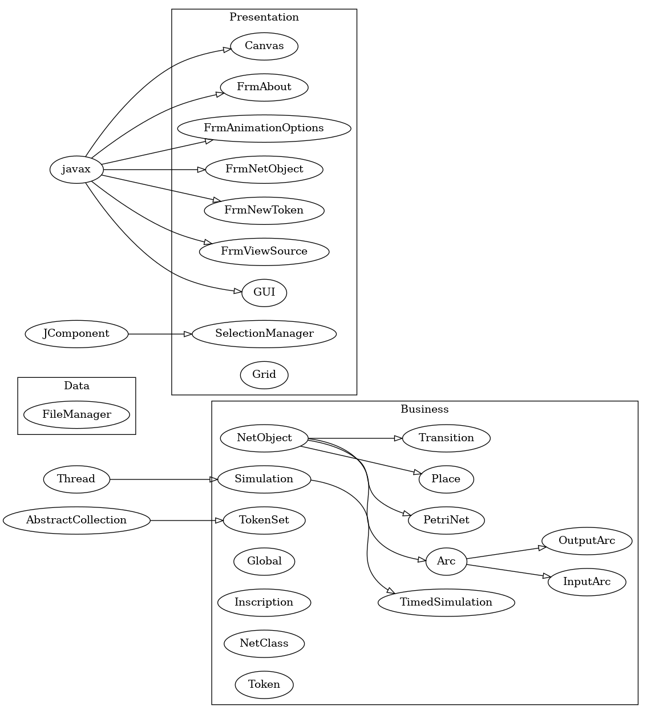
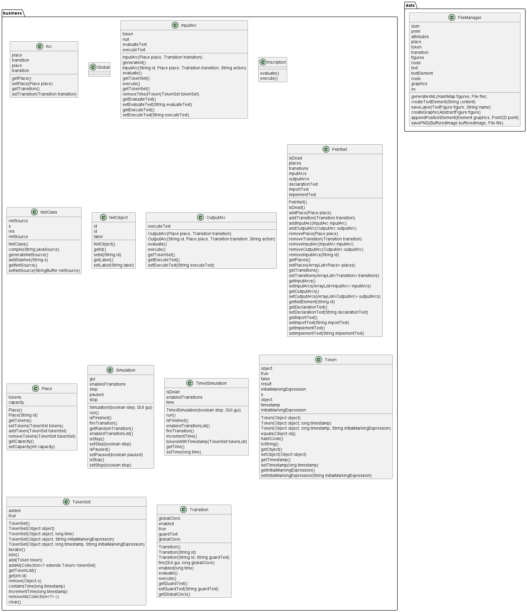

[](https://www.java.com/de/download/faq/java19.xml)
[](https://ant.apache.org/)
[](https://junit.org/junit5/)
# Assignment im Modul SWE20

## Entwicklung einer Java-Anwendung mit GUI zur Simulation und graphischen Auswertung von Petri-Netze
-------------------------------------------------------
## [Langtitel: Petri-Netze]()
_Es ist ein einfacher Petri-Netz-Simulator zu entwickeln und zu implementieren. Hierbei sind_

- _GUI_
- _Simulator_
- _Graphische Auswertung_

-------------------------------------------------------


## Programmausführung
### NetBeans
DAS PROJEKT SETZT VOLLSTÄNDIG AUF DIE `NETBEANS` IDE UM AUCH DIE GUI ZU EDITIEREN.
[DOWNLOAD](https://netbeans.apache.org/download/index.html)

### Visual Studio Code
ES EMPFIEHLT SICH AUCH DIE JAVA-ANWENDUNG MIT `VISUAL STUDIO CODE` ZU STARTEN. ALLE NÖTIGEN ABHÄNGIGKEITEN ZUM [Extension Pack for Java](https://marketplace.visualstudio.com/items?itemName=vscjava.vscode-java-pack) WERDEN DANN AUTOMATISCH VON VISUAL STUDIO CODE INSTALLIERT.


NACH ERFOLGREICHER INSTALLATION ALLER JAVA-PROJEKTABHÄNGIGKEITEN KANN DER PETRI-NETZ-SIMULATOR NACH AUSWAHL DER GUI.JAVA KLASSE SOWIE DAS AUSFÜHREN DES ,,RUN JAVA" VORGANGS IN VSC GESTARTET WERDEN.
 [DOWNLOAD](https://code.visualstudio.com/)


-------------------------------------------------------
## [UML Diagramme]()


-------------------------------------------------------
## [Ant Projektstruktur]()
```
java-petrinet-simulator-gui
├─ .git
├─ .gitignore
├─ assets
│  ├─ export_images
│  │  ├─ 1-example.png
│  │  ├─ 2-sequential.png
│  │  ├─ 3-conflict.png
│  │  ├─ 4-concurrency.png
│  │  ├─ 5-synchronization.png
│  │  ├─ 6-agrupation.png
│  │  ├─ 7-mutual-exclusion.png
│  │  └─ basicphilosophers.png
│  ├─ import_templates
│  │  ├─ 1-example.xml
│  │  ├─ 2-sequential.xml
│  │  ├─ 3-conflict.xml
│  │  ├─ 4-concurrency.xml
│  │  ├─ 5-synchronization.xml
│  │  ├─ 6-agrupation.xml
│  │  ├─ 7-mutual-exclusion.xml
│  │  └─ basicphilosophers.xml
│  └─ uml-diagram
│     ├─ business_detailed_uml.png
│     ├─ business_detailed_with_modifiers_uml.puml
│     ├─ business_uml_with_symbols.png
│     ├─ business_uml_with_symbols.puml
│     ├─ combined_detailed_class_diagram.png
│     ├─ data_detailed_uml.png
│     ├─ data_detailed_with_modifiers_uml.puml
│     ├─ data_uml_with_symbols.png
│     ├─ data_uml_with_symbols.puml
│     └─ uml_diagram_large.png
├─ Images
│  ├─ 01_default_GUI.png
│  ├─ 02_File_Menu.png
│  ├─ 03_File_New_Option.png
│  ├─ 04_File_Open_Option.png
│  ├─ 04_File_Open_Option_2.png
│  ├─ 05_Save_As_Option.png
│  ├─ 06_Export_PNG_Option.png
│  ├─ 07_Exit_Option.png
│  ├─ 08_Run_PetriNet.png
│  ├─ 08_Run_PetriNet_2.png
│  ├─ 09_Stop_PetriNet.png
│  ├─ 10_Navigation_Menu.png
│  ├─ 11_About_Menu.png
│  ├─ 12_Animation_Menu.png
│  ├─ 13_Animation_Settings.png
│  ├─ 14_1_Create_PetriNet.png
│  ├─ 14_2_Create_PetriNet_Place.png
│  ├─ 14_3_Create_PetriNet_Transition.png
│  ├─ 14_4_Create_PetriNet_Normal_Arc.png
│  ├─ 14_5_Create_PetriNet_Toogle_Grid.png
│  ├─ 14_6_Create_PetriNet_Run.png
│  ├─ 14_7_Create_PetriNet_Step.png
│  ├─ 14_8_1_Create_PetriNet_Select.png
│  ├─ 14_8_2_Create_PetriNet_Select.png
│  ├─ 14_9_1_Create_PetriNet_Save.png
│  ├─ 15_1_View_PetriNet_Sourcecode.png
│  ├─ 15_2_View_PetriNet_Sourcecode_Menu.png
│  ├─ 3.1_Benutzeranforderungen_GUI-Planung.png
│  ├─ Edge (Normal Arc).png
│  └─ Zeichenkonzepte
│     ├─ 2024-02-21 13_16_41-Excalidraw.png
│     ├─ 2024-02-21 13_19_48-Excalidraw.png
│     ├─ 3.1_Benutzeranforderung_Zeichenkonzept.png
│     ├─ 3.1_Benutzeranforderung_Zeichenkonzept_FileManager Option.png
│     ├─ 3.1_Benutzeranforderung_Zeichenkonzept_Place Popup.png
│     ├─ GUI_Zeichenkonzept.png
│     └─ GUI_Zeichenkonzept2.png
├─ lib
│  ├─ byte-buddy-1.14.10.jar
│  ├─ byte-buddy-agent-1.14.10.jar
│  ├─ hamcrest-core-1.3.jar
│  ├─ janino.jar
│  ├─ junit-4.13.2.jar
│  ├─ mockito-core-5.8.0.jar
│  └─ objenesis-3.3.jar
├─ manifest.mf
├─ nbproject
│  ├─ private
│  │  └─ private.xml
│  └─ project.xml
├─ README.md
├─ readme.txt
├─ readme.url
├─ src
│  ├─ business
│  │  ├─ Arc.java
│  │  ├─ Global.java
│  │  ├─ InputArc.java
│  │  ├─ Inscription.java
│  │  ├─ NetClass.java
│  │  ├─ NetObject.java
│  │  ├─ OutputArc.java
│  │  ├─ PetriNet.java
│  │  ├─ Place.java
│  │  ├─ Simulation.java
│  │  ├─ TimedSimulation.java
│  │  ├─ Token.java
│  │  ├─ TokenSet.java
│  │  └─ Transition.java
│  ├─ data
│  │  └─ FileManager.java
│  └─ presentation
│     ├─ Canvas.form
│     ├─ Canvas.java
│     ├─ figures
│     │  ├─ AbstractArcFigure.java
│     │  ├─ AbstractFigure.java
│     │  ├─ ConnectionFigure.java
│     │  ├─ NormalArcFigure.java
│     │  ├─ PathPoint.java
│     │  ├─ PlaceFigure.java
│     │  ├─ TextFigure.java
│     │  ├─ TokenSetFigure.java
│     │  └─ TransitionFigure.java
│     ├─ FrmAbout.form
│     ├─ FrmAbout.java
│     ├─ FrmAnimationOptions.form
│     ├─ FrmAnimationOptions.java
│     ├─ FrmNetObject.form
│     ├─ FrmNetObject.java
│     ├─ FrmNewToken.form
│     ├─ FrmNewToken.java
│     ├─ FrmViewSource.form
│     ├─ FrmViewSource.java
│     ├─ Grid.java
│     ├─ GUI.form
│     ├─ GUI.java
│     ├─ icons
│     │  ├─ about.png
│     │  ├─ afegir_token.png
│     │  ├─ Animated_Petri_net_commons.gif
│     │  ├─ animation.png
│     │  ├─ borrar_token.png
│     │  ├─ createPlace.png
│     │  ├─ createTransition.png
│     │  ├─ exit.png
│     │  ├─ export.png
│     │  ├─ grid.png
│     │  ├─ icon.png
│     │  ├─ icons.txt
│     │  ├─ netsource.png
│     │  ├─ new.png
│     │  ├─ normalarc.png
│     │  ├─ open.png
│     │  ├─ pause.png
│     │  ├─ play.png
│     │  ├─ reload.png
│     │  ├─ save.png
│     │  ├─ select.png
│     │  ├─ step.png
│     │  └─ stop.png
│     └─ SelectionManager.java
└─ test
   └─ business
      ├─ ArcTest.java
      ├─ GlobalTest.java
      ├─ InputArcTest.java
      ├─ NetClassTest.java
      ├─ NetObjectTest.java
      ├─ OutputArcTest.java
      ├─ PetriNetTest.java
      ├─ PlaceTest.java
      ├─ SimulationTest.java
      ├─ TimedSimulationTest.java
      ├─ TokenSetTest.java
      ├─ TokenTest.java
      └─ TransitionTest.java

```
-------------------------------------------------------
## [Properties]()


## [Dependencies]()

- [janino](https://repo1.maven.org/maven2/org/codehaus/janino/janino/3.1.4/) 
- [junit](https://junit.org/junit5/) v5.6.0

## [Build]()

---

## Credits

### Creator

**Davain Pablo Edwards**


### Environment requirements

- [Apache Ant](hhttps://ant.apache.org/)
- [Java](https://www.java.com/de/download/)
- [NetBeans](https://netbeans.apache.org/download/index.html)
- [Visual Studio Code](https://code.visualstudio.com/download)

---
## License

GNU General Public License Version 3

Copyright (c) 2024 Davain Pablo Edwards

Dieses Programm ist freie Software: Sie können es unter den Bedingungen
der GNU General Public License, wie von der Free Software Foundation,
Version 3 der Lizenz oder (nach Ihrer Wahl) jeder späteren
veröffentlichten Version, weitergeben und/oder modifizieren.

 Dieses Programm wird in der Hoffnung, dass es nützlich sein wird, aber
 OHNE JEDE GEWÄHRLEISTUNG, bereitgestellt; sogar ohne die implizite
 Gewährleistung der MARKTFÄHIGKEIT oder EIGNUNG FÜR EINEN BESTIMMTEN ZWECK.
 Siehe die GNU General Public License für weitere Details.

 Für weitere Informationen zur Lizens, siehe <http://www.gnu.org/licenses/>.
